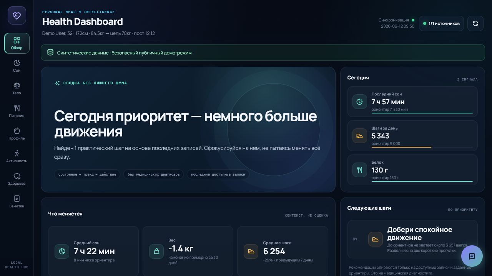
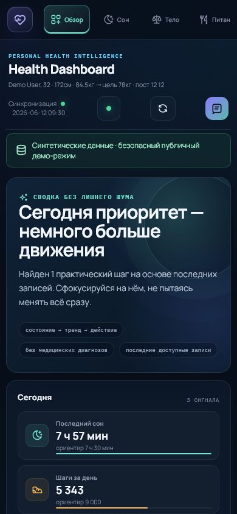
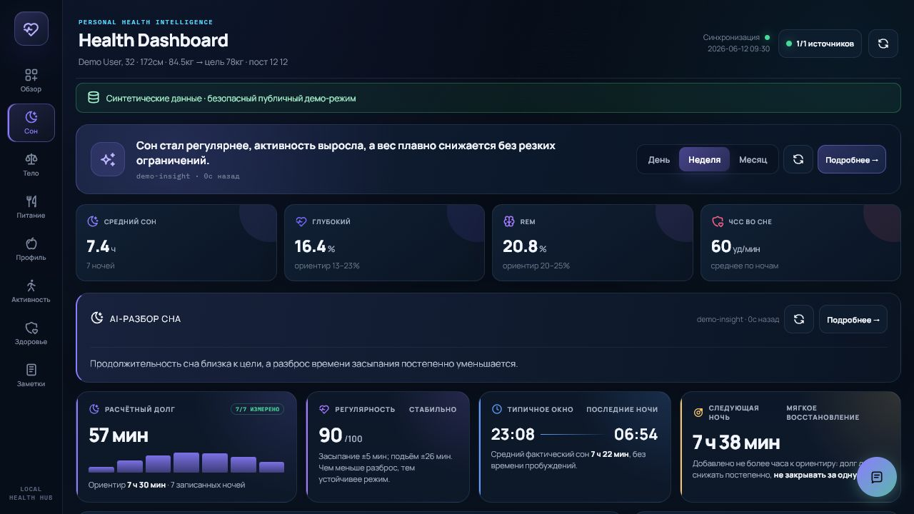
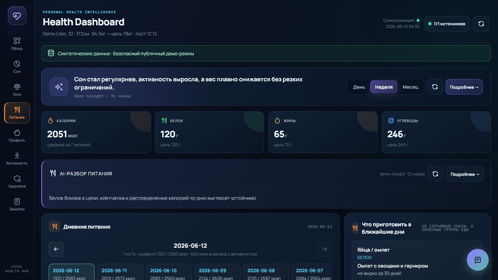

# Local Health Dashboard

A private-by-default health data hub that combines sleep, body composition,
nutrition, activity, workouts, notes, and cautious AI-assisted insights in one
local dashboard.

[](https://github.com/Alexsander720/local-health-dashboard/actions/workflows/ci.yml)
[](LICENSE)

The project is designed for people whose health history is fragmented across
wearables and mobile apps. It normalizes those sources into a single timeline,
shows data quality and freshness, and keeps the personal dataset on the user's
machine.



## Public Demo

The public demo is deterministic, read-only, and uses synthetic data only:

- [Open the live synthetic demo](https://alexsander720.github.io/local-health-dashboard/)
- [View the first release](https://github.com/Alexsander720/local-health-dashboard/releases/tag/v0.1.0)

```powershell
python -m pip install -r requirements.txt
python dashboard_server.py --demo --port 8788
```

Open [http://127.0.0.1:8788/](http://127.0.0.1:8788/).

Demo mode does not read local health exports, measurements, notes, food
preferences, credentials, or AI cache files. All mutation endpoints return
`403`.

You can also build a standalone synthetic dashboard:

```powershell
python build_dashboard.py --demo
```

<details>
<summary>More screenshots</summary>

### Mobile Overview



### Sleep



### Nutrition



</details>

## What It Covers

- sleep duration, stages, regularity, and estimated sleep debt;
- weight, body composition, and manual body measurements;
- calories, macros, meal diary, and food preferences;
- steps, active minutes, workouts, and training history;
- heart rate, stress, and SpO2;
- personal notes and correlations across domains;
- section-specific AI summaries with explicit uncertainty.

Current integrations include Mobvoi Health, Health Connect, Google Fit, YAZIO,
Zepp-compatible scale exports, and KS Fit.

## Personal Mode

Personal mode expects a local normalized export at
`sleep-data/latest_sync.json`:

```powershell
python dashboard_server.py
```

The server binds to `127.0.0.1` by default. Do not expose it on a public
interface without adding authentication and TLS.

Refresh the local dataset:

```powershell
python health_sync.py --days 14 --wake-mobvoi
python gemini_analyzer.py --period all
python build_dashboard.py
```

AI features currently use Google Cloud OAuth:

```powershell
gcloud auth login
```

The Google Cloud project ID is stored locally in `gemini_project.txt`, which is
ignored by Git.

## Architecture

```text
phone and app exports
        |
        v
health_sync.py ---------> sleep-data/latest_sync.json
        |                             |
        |                             v
        +--------------------> build_dashboard.py
                                      |
gemini_analyzer.py -------------------+
                                      |
                                      v
                              dashboard_server.py
                                      |
                                      v
                           local standalone dashboard
```

Domain logic is being extracted incrementally into `health_dashboard/domain`.
Compatibility scripts remain in place while the storage, source adapter, AI,
and web layers are separated.

## Privacy And Safety

- Personal exports and sidecar files are excluded by `.gitignore`.
- The API is same-origin and rejects foreign-origin mutations.
- Model-generated HTML is passed through a DOM allowlist sanitizer.
- Writes use atomic replacement.
- Sync and AI refresh jobs use single-flight locks.
- The dashboard is wellness software, not a diagnostic medical device.

Before publishing a fork, run a secret scan and verify that no real health
exports, screenshots, cookies, tokens, device identifiers, or AI caches are
tracked.

The repository includes a high-confidence publication gate:

```powershell
python scripts/public_release_audit.py
```

## Tests

```powershell
python -m unittest discover -s tests -q
```

The suite covers domain calculations, data merging, persistence, API security,
concurrency, HTML contracts, demo isolation, and responsive browser behavior.

## Project Status

This is an early OSS release built from a working personal system. The
cross-domain Overview is available, and the next work focuses on source
adapters, data provenance, maintenance automation, and broader testing.
Priorities are tracked in
[`docs/PROJECT_AUDIT_AND_ROADMAP.md`](docs/PROJECT_AUDIT_AND_ROADMAP.md).

## Contributing

See [CONTRIBUTING.md](CONTRIBUTING.md). Security issues should follow
[SECURITY.md](SECURITY.md). General support guidance is in
[SUPPORT.md](SUPPORT.md), and community expectations are in
[CODE_OF_CONDUCT.md](CODE_OF_CONDUCT.md).

## License

MIT. See [LICENSE](LICENSE).
